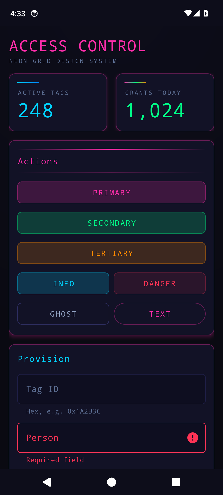
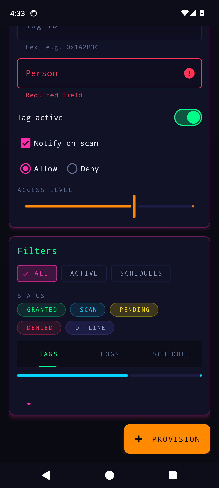

# Neon Grid — Android (Material 3)

A complete, drop-in **Material 3** theme. Dark substrate, full neon spectrum, glowing controls.
Themes virtually every Material widget out of the box — buttons, FAB, cards, text fields, switches,
checkboxes, radios, sliders, chips, tabs, app bar, bottom-nav, nav-rail, nav-drawer, snackbar,
dialog, bottom-sheet, progress, badge, divider.

## Demo

[`sample/`](sample/) is a runnable demo that applies `Theme.NeonGrid` to
[`@layout/ng_showcase`](theme/src/main/res/layout/ng_showcase.xml) — captured on an Android 14
emulator below.

| Components & actions | Controls, chips, tabs, progress |
|:---:|:---:|
|  |  |

```bash
./gradlew :sample:installDebug   # build + install the demo on a running device/emulator
```

## Install

**Option A — as a module.** Copy [`theme/`](theme/) into your project, add `include(":theme")` to
`settings.gradle.kts`, and depend on it:

```kotlin
dependencies { implementation(project(":theme")) }
```

**Option B — copy resources.** Copy `theme/src/main/res/{values,color,drawable,layout}` into your
app module and add Material: `implementation("com.google.android.material:material:1.12.0")`.

## Apply

Set the theme on your app or activity in `AndroidManifest.xml`:

```xml
<application android:theme="@style/Theme.NeonGrid">
```

Use Material widgets (`com.google.android.material.button.MaterialButton`, `MaterialCardView`,
`TextInputLayout`, `MaterialSwitch`, `Chip`, …) — they pick up the neon styling automatically.
Variants are opt-in via `style=`:

```xml
<com.google.android.material.button.MaterialButton style="@style/Widget.NeonGrid.Button.Secondary" .../>
```

A full reference layout lives at `@layout/ng_showcase` — set it as a content view to see everything.

## Color roles

| Material role | Color | | Material role | Color |
|---|---|---|---|---|
| `colorPrimary` | fuchsia | | `colorTertiary` | orange |
| `colorSecondary` | green | | `colorError` | red |

`cyan` (info), `blue` (metric gradients), `violet` (brand gradients) and `yellow` (caution) are
applied directly by the styles and gradient drawables (`ng_gradient_brand`, `ng_gradient_value`,
`ng_accent_line_*`). Raw tokens are `@color/ng_fuchsia`, `@color/ng_green`, `@color/ng_orange`,
`@color/ng_cyan`, `@color/ng_blue`, `@color/ng_violet`, `@color/ng_red`, `@color/ng_yellow`.

## Button variants

`Widget.NeonGrid.Button` (fuchsia, default) · `.Secondary` (green) · `.Tertiary` (orange) ·
`.Info` (cyan) · `.Danger` (red) · `.Ghost` · `.Outlined` · `.Text` · `.Tonal` · `.Icon` · `.Small`.

Status pills: `Widget.NeonGrid.Chip.Status.{Success,Info,Warning,Danger,Neutral}`.

## Fonts (optional upgrade to the exact look)

The theme ships with system fonts (`sans-serif-medium` display, `monospace` body) so it builds and
looks strong anywhere. For the reference's exact **Orbitron** display + **Share Tech Mono** body,
wire up [Downloadable Fonts](https://developer.android.com/develop/ui/views/text-and-emoji/downloadable-fonts):
create `res/font/orbitron.xml` and `res/font/share_tech_mono.xml` (Google Fonts provider), add the
`com_google_android_gms_fonts_certs` array + a `preloaded_fonts` meta-data, then point the display
text appearances at `@font/orbitron` and the body/mono ones at `@font/share_tech_mono`.

## Notes

- **No scanlines** (by design). The faint **grid** is `@drawable/ng_grid_overlay` — apply it to a
  root view's foreground for the lattice; the window already uses `@drawable/ng_window_background`.
- **Glow:** Android can't render outer color-blur, so glow is approximated with colored elevation
  shadows (`outlineSpotShadowColor`, API 28+) on cards/FAB and `shadowRadius` on accent text.
- minSdk 24, compileSdk 36, Material 1.12.0.
