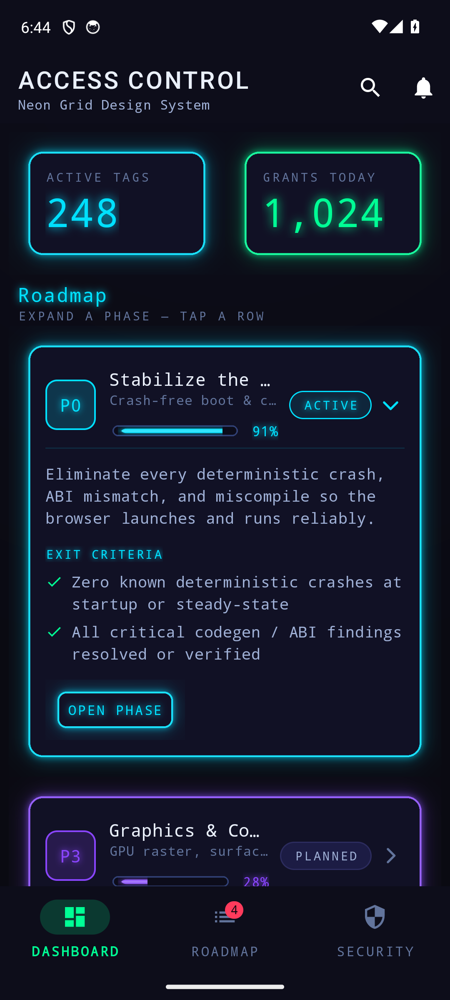
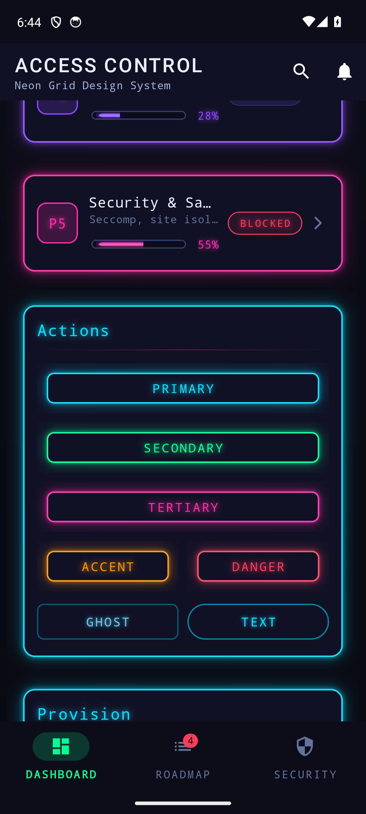
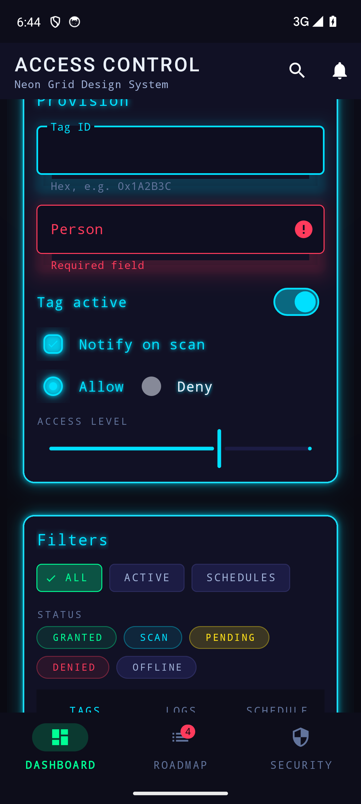
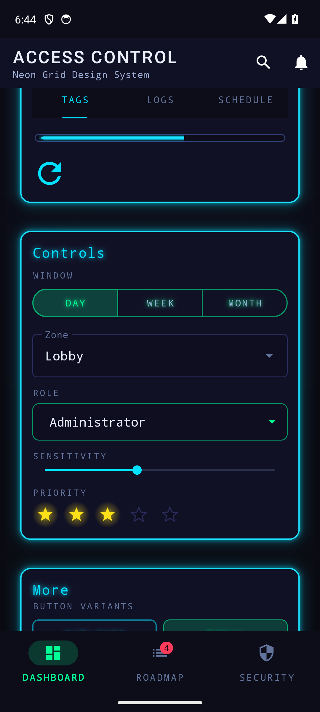
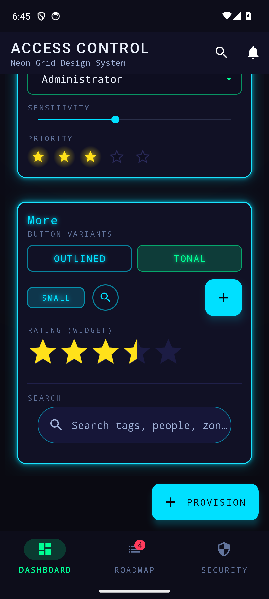

# Neon Grid — Android (Material 3)

A complete, drop-in **Material 3** theme. Dark substrate, full neon spectrum, glowing controls,
and **one-knob recoloring** — every accent derives from a handful of theme attributes (see
[Color roles & customizing](#color-roles--customizing)).

Themes virtually every Material + platform widget out of the box — buttons, segmented/toggle
groups, FAB & extended FAB, cards, **expand/collapse accordions**, text fields, exposed dropdowns,
switches, checkboxes, radios, sliders, seek bars, rating bars, spinners, chips, **neon state pills**,
**icon tiles**, tabs, app bar, bottom app bar, collapsing toolbar, bottom-nav, nav-rail, nav-drawer,
popup menus, tooltips, snackbar, dialog, bottom-sheet, date/time pickers, search bar/view, progress,
badge, divider.

## Demo

[`sample/`](sample/) is a runnable demo that applies `Theme.NeonGrid` to
[`@layout/ng_showcase`](theme/src/main/res/layout/ng_showcase.xml) — captured on an Android 14
emulator below.

| Roadmap accordions · stat cards · app bar | Buttons · field glows | Selection · chips · tabs · progress |
|:---:|:---:|:---:|
|  |  |  |
| **Segmented · dropdown · rating · button variants** | **Search · FAB · bottom nav** | |
|  |  | |

```bash
./gradlew :sample:installDebug   # build + install the demo on a running device/emulator
```

## Install

**Option A — as a module.** Copy [`theme/`](theme/) into your project, add `include(":theme")` to
`settings.gradle.kts`, and depend on it:

```kotlin
dependencies { implementation(project(":theme")) }
```

**Option B — copy resources.** Copy `theme/src/main/res/{values,color,drawable,layout}` into your
app module and add Material: `implementation("com.google.android.material:material:1.12.0")`.

## Apply

Set the theme on your app or activity in `AndroidManifest.xml`:

```xml
<application android:theme="@style/Theme.NeonGrid">
```

Use Material widgets (`com.google.android.material.button.MaterialButton`, `MaterialCardView`,
`TextInputLayout`, `MaterialSwitch`, `Chip`, …) — they pick up the neon styling automatically.
Variants are opt-in via `style=`:

```xml
<com.google.android.material.button.MaterialButton style="@style/Widget.NeonGrid.Button.Secondary" .../>
```

A full reference layout lives at `@layout/ng_showcase` — set it as a content view to see everything.

## Color roles & customizing

Every widget — fill, stroke, label, border, title, switch, checkbox, radio, indicator — derives from
**four theme attributes** through color-state-lists that reference them with `android:alpha`. Override
any of them in a theme that extends `Theme.NeonGrid` and the **whole system recolors**, translucent
neon fills and glowing strokes included. No per-widget restyling.

Widgets follow **Material 3's default color role** for each component, recolored to the neon palette:

| Attribute | Default | Drives (Material 3 role per widget) |
|---|---|---|
| `colorPrimary` | cyan | buttons, switch, checkbox, radio, text fields, slider, seek bar, FAB, tabs, linear + circular progress, snackbar/dialog actions, **borders, titles** |
| `colorSecondary` | green | tonal button, filter chips, segmented buttons, spinner, navigation (bar / rail / drawer) |
| `colorTertiary` | fuchsia | the `.Tertiary` button variant |
| `ngAccent` | orange | the `.Accent` button variant |
| `colorError` | red | `.Danger` button, field errors, badge |

Status pills and the **rating stars** (neon yellow with a glow halo) keep fixed semantic hues.

```xml
<!-- Recolor the entire theme from one place: -->
<style name="Theme.MyApp" parent="Theme.NeonGrid">
    <item name="colorPrimary">@color/my_violet</item>  <!-- borders, titles, switches, checks… all follow -->
    <item name="ngAccent">@color/my_amber</item>        <!-- FAB + slider follow -->
</style>
```

`blue` / `violet` / `yellow` stay direct in the gradient drawables (`ng_gradient_brand`,
`ng_gradient_value`, `ng_accent_line_*`) for metric/brand washes and caution. Raw tokens are
`@color/ng_fuchsia`, `@color/ng_green`, `@color/ng_orange`, `@color/ng_cyan`, `@color/ng_blue`,
`@color/ng_violet`, `@color/ng_red`, `@color/ng_yellow`.

## Button variants

`Widget.NeonGrid.Button` (cyan, default) · `.Secondary` (green) · `.Tertiary` (fuchsia) ·
`.Accent` (orange) · `.Danger` (red) · `.Ghost` · `.Outlined` · `.Text` · `.Tonal` · `.Icon` ·
`.Small` · `.Segmented` (toggle-group children).

Status pills: `Widget.NeonGrid.Chip.Status.{Success,Info,Warning,Danger,Neutral}`.

## Accordions, state pills & tiles

The **accordion** (the refreshed roadmap "phase" pattern) is a colored left-accent card whose
clickable header row — **tile · title + tagline · neon progress · state pill · caret** — reveals a
hairline-separated body. The theme supplies the look as a style set; behaviour is one toggle (flip
the body's visibility, rotate the caret), shown in the sample's `MainActivity` with a
`TransitionManager` for the smooth grow/shrink.

- **Drop-in item:** `@layout/ng_accordion_item` — `<include>` it, or copy the block from
  [`@layout/ng_showcase`](theme/src/main/res/layout/ng_showcase.xml) (the **Roadmap** section stacks
  three: cyan/active expanded, violet/planned, fuchsia/blocked).
- **Styles:** `Widget.NeonGrid.Accordion` (panel) · `.Header` · `.Tile` · `.Title` · `.Tagline` ·
  `.Caret` · `.Body`, plus `Widget.NeonGrid.LinearProgress.Phase` for the chunky rounded header bar.
- **State pills** (non-interactive neon status capsules, no ripple/touch-target):
  `Widget.NeonGrid.StatePill.{Active,Done,Blocked,Planned}`.
- **Icon tiles** (lit rounded squares for phase keys, avatars, logo marks):
  `@drawable/ng_tile_{cyan,green,fuchsia,orange,violet,red}` — put a hue-matched glyph on top.

Recolor a row by swapping its 4dp left-stripe color, the tile background + text color, the progress
`app:indicatorColor`, and the state-pill style — everything else follows the theme.

## Glow system (standardized)

Glow is the theme's organizing grammar — **every interactive element glows**, in one consistent
language, on a single tiered ramp (so the screen has hierarchy and nothing reads flat or dead):

| Tier | radius (`@dimen`) | elements |
|---|---|---|
| **HOT** | `ng_glow_t1` (14) | filled buttons, FAB, checked checkbox/radio, glow buttons |
| **WARM** | `ng_glow_t2` (11) | outlined · tonal · segmented-selected · switch-on label · accent text |
| **EMBER** | `ng_glow_t3` (8) | ghost · text buttons · status pills · active control labels |
| *off* | — | unselected segments/chips, Neutral pill, `StatePill.Planned`, dim metadata, **disabled** |

Each element carries glow through up to three stackable channels: **text-glow** (`android:shadowColor`
/`shadowRadius` on the label — works on all minSdk 24), a baked **9-patch bloom** (cards, glow
buttons, pills, checkbox/radio sprites), and a colored **elevation halo**
(`outlineSpotShadowColor`, API 28+). The whole bloom scales from one knob: edit
[`res/values/dimens.xml`](theme/src/main/res/values/dimens.xml) for text-glow and re-run
[`tools/gen_glow.py`](../tools/gen_glow.py) (`GLOW_SCALE`) for the baked sprites.

**Accessibility:** glow is always *additive decoration, never load-bearing* — every label passes
contrast with the shadow disabled. Selection is signalled by a glow **delta** (on = glow, off = none)
in addition to hue, and disabled states drop all glow. **Downstream note:** the baked bloom lives in
transparent 9-patch padding, so set `android:clipChildren="false"` / `android:clipToPadding="false"`
on containers (button rows, chip/segmented groups, cards) or the halos clip at the edge.

## Fonts (optional upgrade to the exact look)

The theme ships with system fonts (`sans-serif-medium` display, `monospace` body) so it builds and
looks strong anywhere. For the reference's exact **Orbitron** display + **Share Tech Mono** body,
wire up [Downloadable Fonts](https://developer.android.com/develop/ui/views/text-and-emoji/downloadable-fonts):
create `res/font/orbitron.xml` and `res/font/share_tech_mono.xml` (Google Fonts provider), add the
`com_google_android_gms_fonts_certs` array + a `preloaded_fonts` meta-data, then point the display
text appearances at `@font/orbitron` and the body/mono ones at `@font/share_tech_mono`.

## Notes

- **No scanlines** (by design). The faint **grid** is `@drawable/ng_grid_overlay` — apply it to a
  root view's foreground for the lattice; the window already uses `@drawable/ng_window_background`.
- **Glow:** Android can't render outer color-blur, so glow is approximated with colored elevation
  shadows (`outlineSpotShadowColor`, API 28+) on cards/FAB and `shadowRadius` on accent text.
- minSdk 24, compileSdk 36, Material 1.12.0.
